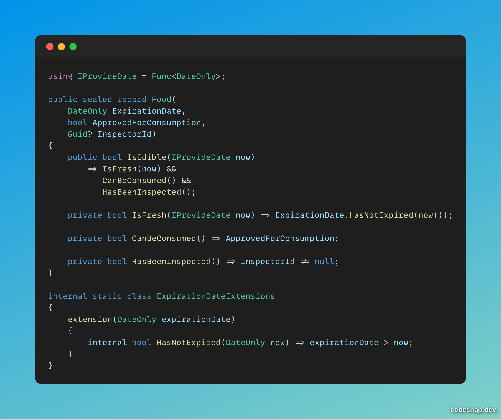

# Advent of Craft 2025

## Solution DAY 00

- Contributor Discord Name : CedricHulin
- Stack : C#
- Fork : https://github.com/HulinCedric/advent-of-craft-2025/tree/day00

## More feedback to share (optional)

- I loved the experience because: Short and accurate regarding one refactoring move. Power of naming.
- I found the exercise could be better if: Guessing domain language is fine, but some small hint could be given to drive method naming during extraction.

## Code Snippet

