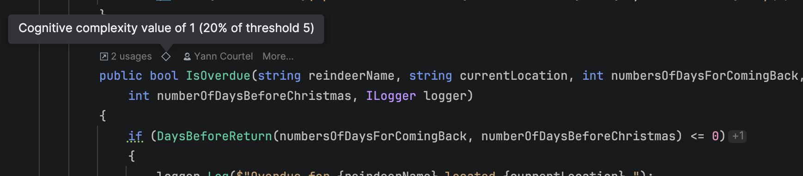
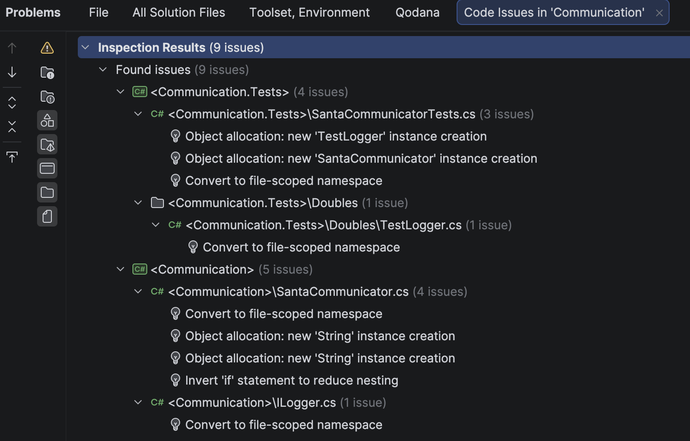
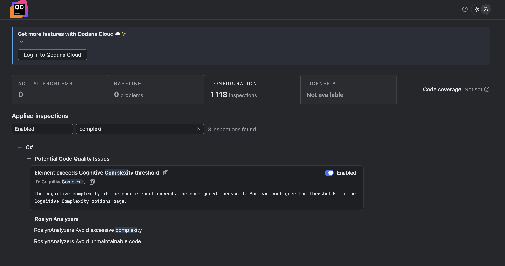
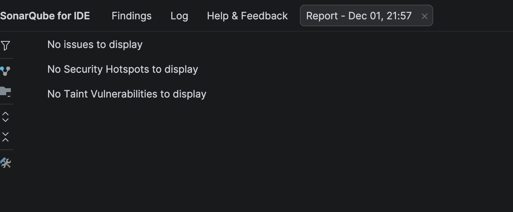
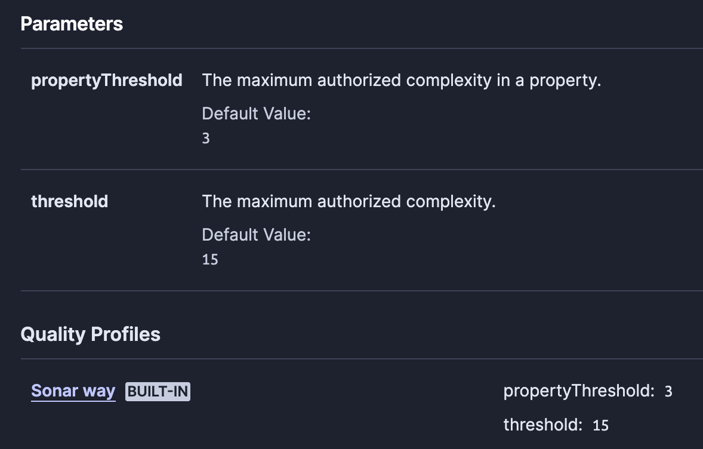

# Advent of Craft 2025

## Solution DAY 01

- Contributor Discord Name : 
- Stack : 
- Fork : 

## More feedback to share (optional)

- I loved the experience because:
- I found the exercise could be better if:

# Experimentations

## Cyclomatic Complexity Jetbrains Rider Plugin

I used the [CyclomaticComplexity Jetbrains Rider Plugin](https://plugins.jetbrains.com/plugin/10395-cyclomaticcomplexity) to measure the cyclomatic complexity of the code.

The threshold is defined to 5 in the IDE settings.

There is no warning, regarding the code base.

## Cognitive Complexity Jetbrains Rider Plugin

I used the [CognitiveComplexity Jetbrains Rider Plugin](https://plugins.jetbrains.com/plugin/12024-cognitivecomplexity) to measure the cognitive complexity of the code.

The threshold is defined to 5 in the IDE settings.

There is no warning, regarding the code base.

The `IsOverdue` method has the highest cognitive complexity of 1.

I suspect that the cognitive complexity is not calculated well because the number of parameters is high (5 parameters).

## Jetbrains Rider Code Inspection

I used the [Jetbrains Rider Code Inspection](https://www.jetbrains.com/help/rider/Code_Analysis__Code_Inspections.html) to measure the code complexity.

There is no warning, regarding the code base, but some hints to improve the code quality.

Nothing regarding complexity.

## Qodana

I used [Qodana](https://www.jetbrains.com/qodana/) to measure the code complexity.

There is no warning on complexity, regarding the code base.

## SonarQube for IDE

I used the [SonarQube for IDE](https://plugins.jetbrains.com/plugin/7973-sonarqube-for-ide) to measure the code complexity.

There is no warning on complexity, regarding the code base.

The cognitive complexity threshold is defined to 15 by default.
That's is pretty high.

## SonarQube Cloud

I used [SonarQube Cloud](https://sonarcloud.io/) to measure the code complexity.

There is no warning on complexity, regarding the code base.

The Cloud solution does not provide more insights or rules than the IDE plugin.
The cognitive complexity threshold is defined to 15 by default.

## CodeScene Jetbrains Rider Plugin

I used the [CodeScene Jetbrains Rider Plugin](https://plugins.jetbrains.com/plugin/25401-codescene) to measure the code complexity.

The plugin detects structural code smells.

> **Excess Number of Function Arguments**
> 
> Functions with many arguments indicate either
> 
> - low cohesion where the function has too many responsibilities, or
> - a missing abstraction that encapsulates those arguments.

The code smell detecte is [Long Parameter List](https://refactoring.guru/smells/long-parameter-list).
Where solution can be to [Introduce Parameter Object](https://refactoring.guru/introduce-parameter-object).

# Conclusion

All tools tested, except CodeScene, have not detected structural problems in the code base.
It is possible to configure the tools to be more restrictive, but this will trigger too many false positives.

The code seems pretty simple in point of view of complexity of tools used.

The code smells was not detected:
- Primitive Obsession
- Long Parameter List (Except by CodeScene)

The IA based tools are way more efficient to detect code smells and structural problems in the code base, if prompted well.

