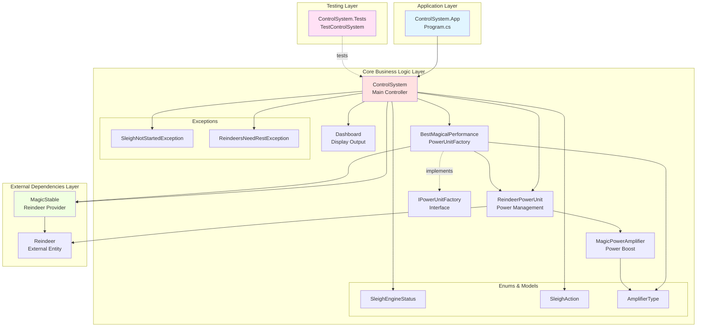
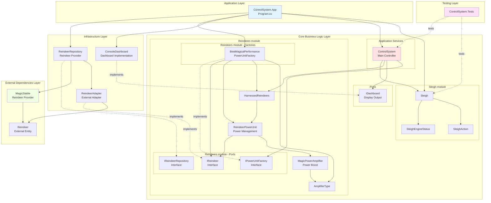

## Architecture Overview (original implementation)

```mermaid
flowchart TB
    subgraph "Application Layer"
        APP["ControlSystem.App<br/>Program.cs"]
    end

    subgraph "Core Business Logic Layer"
        CS["ControlSystem<br/>Main Controller"]
        DASH["Dashboard<br/>Display Output"]
        RPU["ReindeerPowerUnit<br/>Power Management"]
        FACTORY["BestMagicalPerformance<br/>PowerUnitFactory"]
        AMP["MagicPowerAmplifier<br/>Power Boost"]

        subgraph "Enums & Models"
            STATUS["SleighEngineStatus"]
            ACTION["SleighAction"]
            AMPTYPE["AmplifierType"]
        end

        subgraph "Exceptions"
            EX1["SleighNotStartedException"]
            EX2["ReindeersNeedRestException"]
        end

        INT["IPowerUnitFactory<br/>Interface"]
    end

    subgraph "External Dependencies Layer"
        STABLE["MagicStable<br/>Reindeer Provider"]
        DEER["Reindeer<br/>External Entity"]
    end

    subgraph "Testing Layer"
        TEST["ControlSystem.Tests<br/>TestControlSystem"]
    end

    APP --> CS
    CS --> DASH
    CS --> RPU
    CS --> FACTORY
    CS --> STABLE
    CS --> STATUS
    CS --> ACTION
    CS --> EX1
    CS --> EX2

    FACTORY -.->|implements| INT
    FACTORY --> RPU
    FACTORY --> AMPTYPE
    FACTORY --> STABLE

    RPU --> AMP
    RPU --> DEER

    AMP --> AMPTYPE

    STABLE --> DEER

    TEST -.->|tests| CS

    style APP fill:#e1f5ff
    style CS fill:#ffe1e1
    style STABLE fill:#f0ffe1
    style TEST fill:#ffe1f5
```

## Architecture Overview (actual implementation)

```mermaid
flowchart TB
    %% NOTE: This diagram reflects the code as implemented in the solution projects.

    subgraph "Application Layer"
        APP["ControlSystem.App<br/>Program.cs"]
    end

    subgraph "Core Business Logic Layer"
        subgraph "Application Services"
            CS["ControlSystem<br/>Main Controller"]
        end

        subgraph "Ports"
            DASH["IDashboard<br/>Display Output"]
        end

        subgraph "Sleigh module"
            SLEIGH["Sleigh"]
            STATUS["SleighEngineStatus"]
            ACTION["SleighAction"]
        end

        subgraph "Reindeers module"
            HR["HarnessedReindeers"]
            RPU["ReindeerPowerUnit<br/>Power Management"]
            AMP["MagicPowerAmplifier<br/>Power Boost"]
            AMPTYPE["AmplifierType"]

            subgraph "Reindeers module - Ports"
                PUF["IPowerUnitFactory<br/>Interface"]
                IREIN["IReindeer<br/>Interface"]
                RREPO["IReindeerRepository<br/>Interface"]
            end

            subgraph "Reindeers module - Factories"
                FACTORY["BestMagicalPerformance<br/>PowerUnitFactory"]
            end
        end
    end

    subgraph "Infrastructure Layer"
        CONSOLE["ConsoleDashboard<br/>Dashboard Implementation"]
        REPO["ReindeerRepository<br/>Reindeer Provider"]
        ADAPTER["ReindeerAdapter<br/>External Adapter"]
    end

    subgraph "External Dependencies Layer"
        STABLE["MagicStable<br/>Reindeer Provider"]
        EXTDEER["Reindeer<br/>External Entity"]
    end

    subgraph "Testing Layer"
        TESTS["ControlSystem.Tests"]
    end

    %% Composition
    APP --> REPO
    APP --> FACTORY
    APP --> CONSOLE
    APP --> CS
    APP --> SLEIGH

    %% Core orchestration
    CS --> SLEIGH
    CS --> HR
    CS --> DASH
    CS --> PUF

    %% Enum / model usage
    SLEIGH --> STATUS
    SLEIGH --> ACTION

    FACTORY -.->|implements| PUF
    FACTORY --> IREIN
    FACTORY --> RPU
    FACTORY --> HR
    FACTORY --> AMPTYPE

    HR --> RPU
    RPU --> IREIN
    RPU --> AMP
    AMP --> AMPTYPE

    %% Infrastructure implements ports and adapts external
    CONSOLE -.->|implements| DASH

    REPO -.->|implements| RREPO
    REPO --> STABLE
    REPO --> ADAPTER

    ADAPTER -.->|implements| IREIN
    ADAPTER --> EXTDEER

    STABLE --> EXTDEER

    %% Tests reference core
    TESTS -.->|tests| CS
    TESTS -.->|tests| SLEIGH

    style APP fill:#e1f5ff
    style CS fill:#ffe1e1
    style STABLE fill:#f0ffe1
    style TESTS fill:#ffe1f5
```
